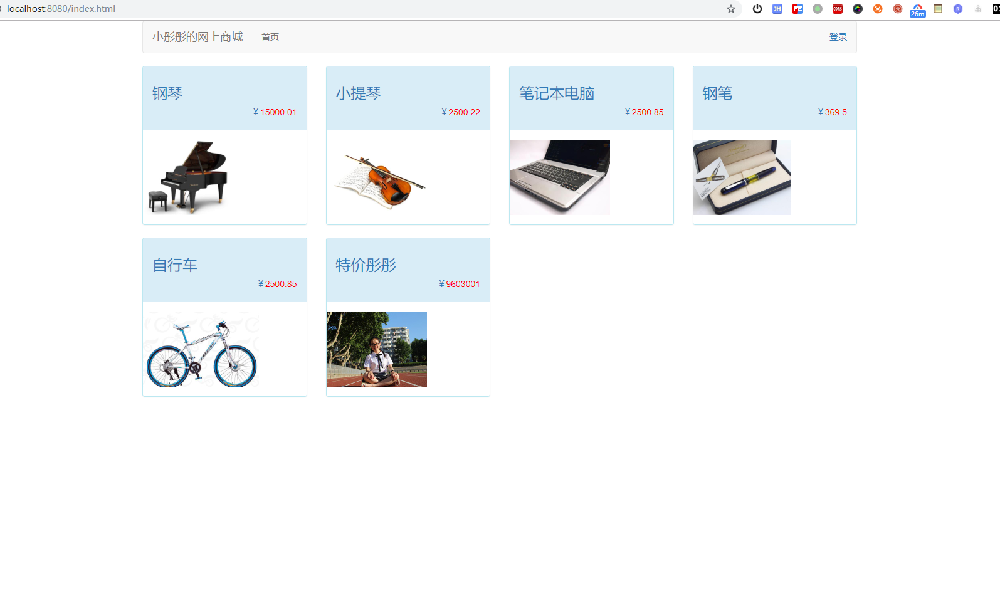
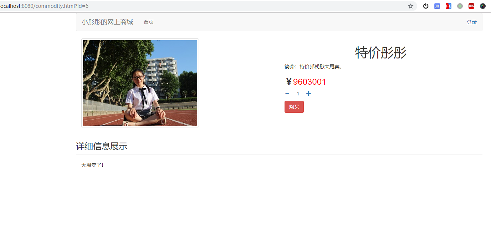
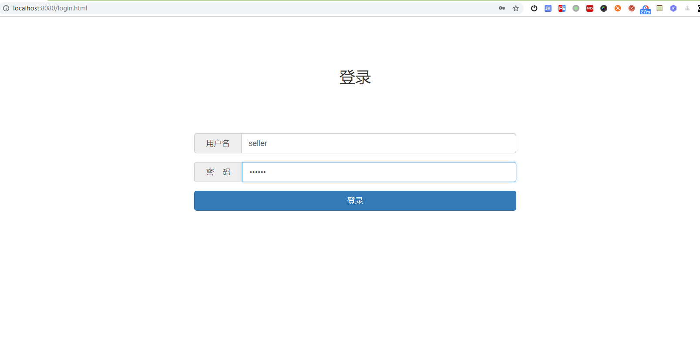
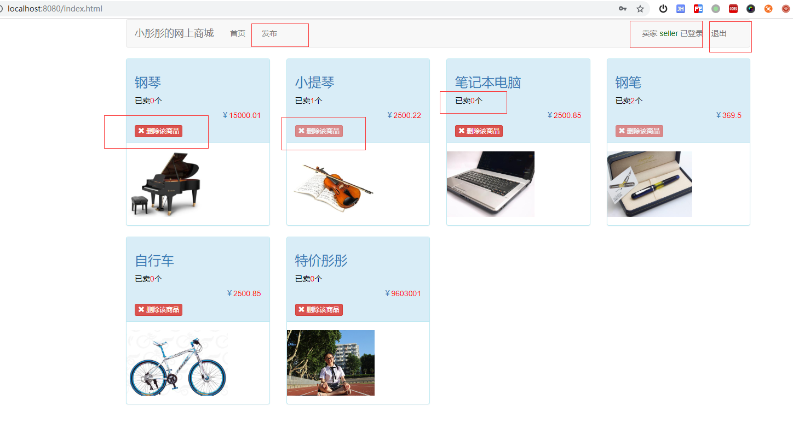
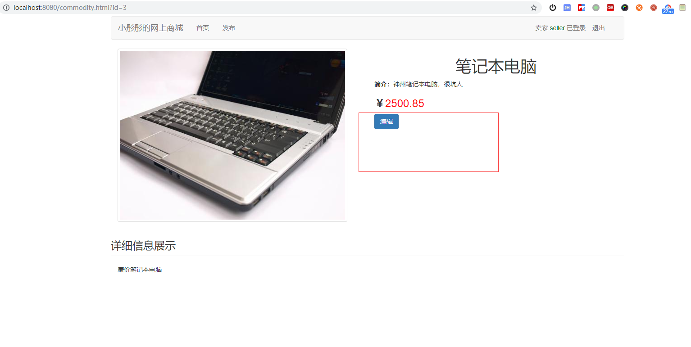
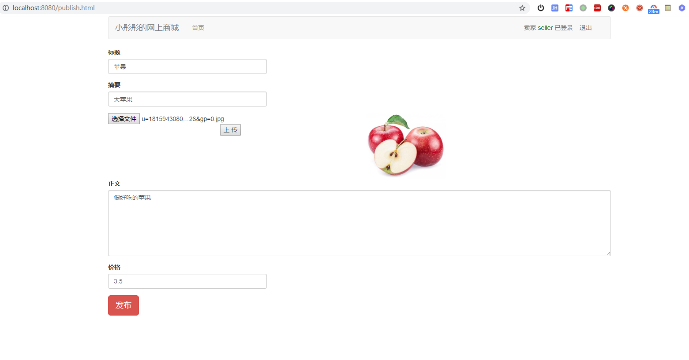
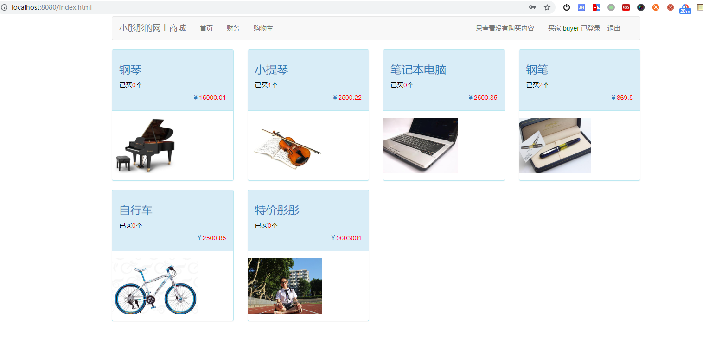
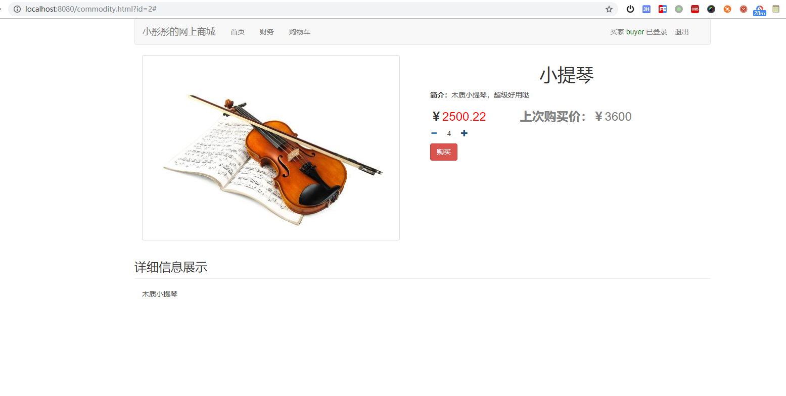
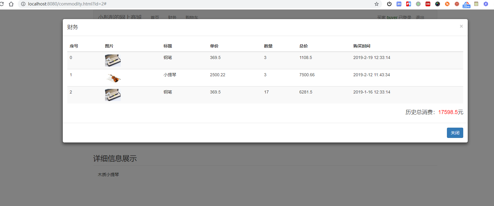
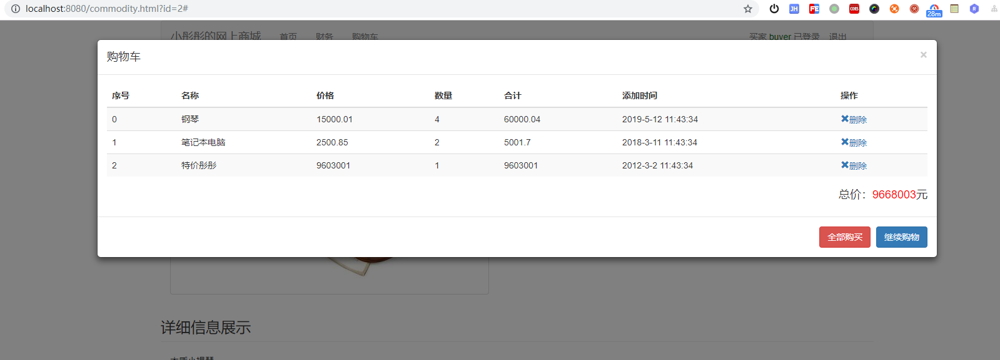

# 提纲

主要有如下几部分
- 系统使用组件及如何运行
- 系统演示（无登录、买家登录、卖家登录）
- 系统优点和缺点

## 系统使用组件及如何运行

系统使用 jdk1.8 编写，理论（没办法测试）兼容 windows、linux、macOS，无需其他任何依赖。

### 使用的组件

系统是前后端完全分离的。
1. 系统后端采用java语言的主流框架springboot2.0，使用了AOP打印web日志
2. 数据库使用的是内嵌的h2数据库，方便demo直接运行，并可以可随时改变为mysql等，只需要更改静态配置文件
3. 前端采用纯html+js，使用的组件有jquery，bootstrap，vue等

### 编译代码

编译代码前确保配置了jdk1.8， 在`\src\main\resources\application.properties` 中是配置文件，在编译代码前可以修改。

在源码根目录执行：`mvnw package` 即可完成编译，无需配置maven环境，第一次编译会下载mvn和各种jar包，编译速度会比较慢。

编译结果在 `target\shopping-system-0.0.1-SNAPSHOT.jar`

### 运行系统

cd到编译结果的目录，直接执行`java -jar shopping-system-0.0.1-SNAPSHOT.jar`即可启动系统。

然后浏览器里访问：`http://localhost:8080/index.html` 

默认的用户名密码是：
1. 买家用户名为buyer，密码为reyub 
2. 卖家用户名为seller，密码为relles

# 系统演示

## 无登录情况下

首页

点击某一个商品可以查看商品目录

这时候如果点购买，会直接跳到登录界面。

## 登录界面

十分简洁的登录界面，登录后会返回之前的页面或者首页。

## 卖家登录

首页

- 显示卖家的id，且可以退出
- 可以删除没有卖出的商品
- 商品上显示已经卖出了多少个

点击某一个商品，可以查看商品详情

- 看不到购买按钮
- 可以编辑该商品（和发布页面使用了相同的html）

点击上方的发布按钮，可以看到发布界面

- 可以上传1张图片
- 可以添加其他信息

## 买家登录

首页

- 看到财务、购物车
- 显示买家id
- 可以在“没有购买的商品”和“全部商品”之间切换
- 商品上显示已经购买了多少个

商品详情页面

- 显示购买按钮
- 如果之前有购买过，显示上次购买价格

财务界面，可以显示历史的每一笔订单，同时显示总消费

购物车界面，可以显示已经添加的商品，也可以删除某一个商品。点击全部购买即可全部购买。

# 系统优点和缺点

## 优点

1. 自动化编译
    - 使用mvnw脚本，自动完成编译打包。且不需要提前配置指定版本的maven
2. 前后端分离
    - 方便前后端一起开发，任务分明
3. AOP统一打印web日志
    - 日志使用aop来打，十分方便
4. 权限设计
    - 自行设计了简陋了token机制，用户登录后给用户返回一个会失效的token
    - 用户不登录的时候，有些api是不能访问的，会被拦截器拦截掉。所有的增删改api都是需要携带token的
5. 不需要人工运行建表sql，且有样例数据
    - demo中在启动时候会增加样例数据。
## 缺点

由于原以为毕业论文五月底交，近期收到通知说4月底交，所以近期毕业论文压力大，目前好多方面尚未完善，列举一些。

1. 数据格式校验
    - 理论应该是数据库设计上校验，后端api接口校验一次，前端用户输入在js中也校验一次
2. 前端细节
    - 前端目前学习不多，使用方面还有很多很多不专业的地方
3. 日志格式
    - 目前后端日志格式方面也有一些乱，没有统一
4. 权限设计没有具体到API和角色
    - 因为没有使用线程的权限设计的框架，所以每一个api和角色的鉴定就没有继续写下去。实际上在目前的拦截器里增加这些逻辑即可。
    

